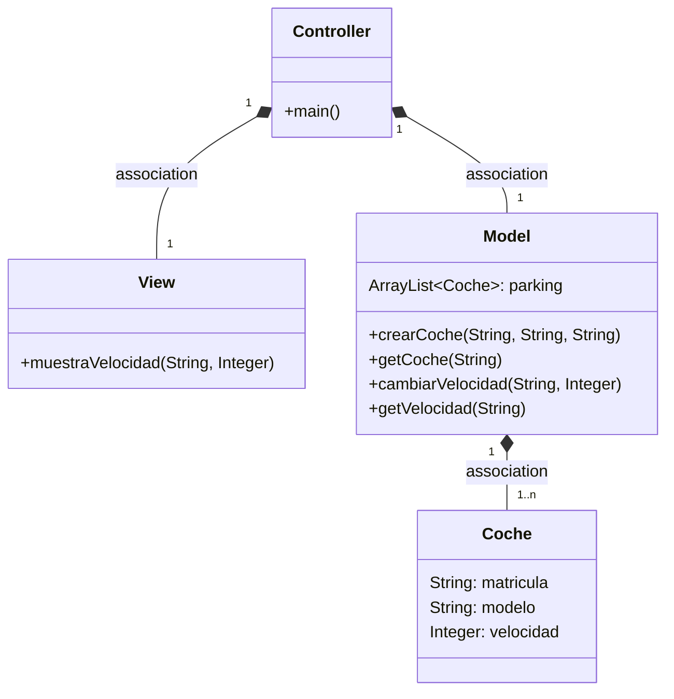
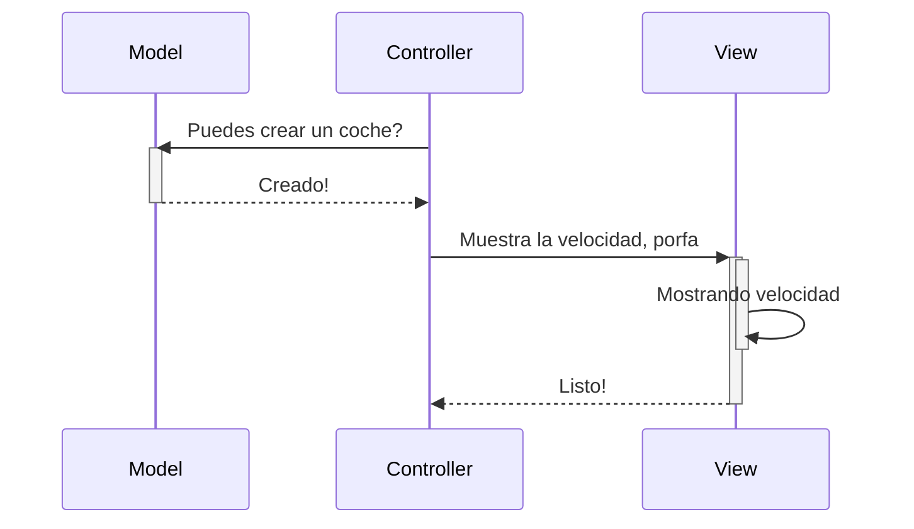
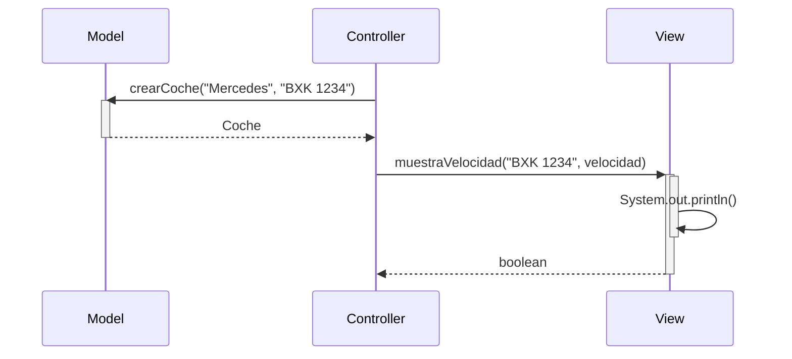

# EXAMEN

Al implementar la función del modelo `avanzar()`, me di cuenta de que en el pseudocódigo no incluí ninguna forma de saber qué coche quieres hacer avanzar.  
También, en el pseudocódigo solo compruebo que la cantidad que quiero avanzar sea positiva, pero en el código tambien compruebo que el coche exista .  
Por último, leyendo ahora el ejercicio, veo que el consumo depende de la velocidad y de la distancia, y en papel solo tuve en cuenta la distancia.
La forma acual es : depósito - (coche.velocidad \* metros) / 100 para calcular el consumo de gasolina y a mayor velocidad mas consumo tienes.
Cuando la anterior era solo `deposito - metros`, que no tenía en cuenta la velocidad.
Ahora, viéndolo ya implementado, cambiaría para que no fuera `void` y devolviera un booleano para saber si se ha podido avanzar o no.

En cambio, la función de `ponerGasolina()` sí que la he implementado como en el pseudocódigo, ya que no hay que comprobar nada más que la cantidad de gasolina sea positiva.
A parte de la View claro, que ya no recordama como estaba.
FIN DEL EXAMEN
----------

# Arquitectura MVC

Aplicación que trabaja con objetos coches, modifica la velocidad y la muestra

---
## Diagrama de clases:

---

## Diagrama de Secuencia

Ejemplo básico del procedimiento, sin utilizar los nombres de los métodos

El mismo diagrama con los nombres de los métodos

