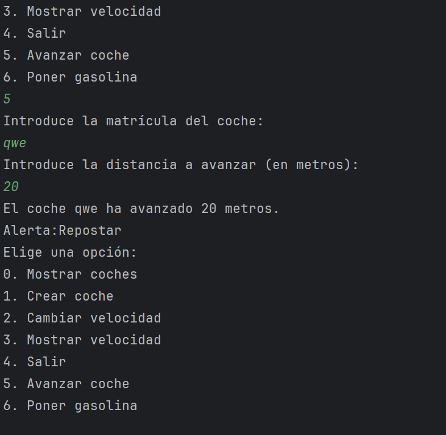
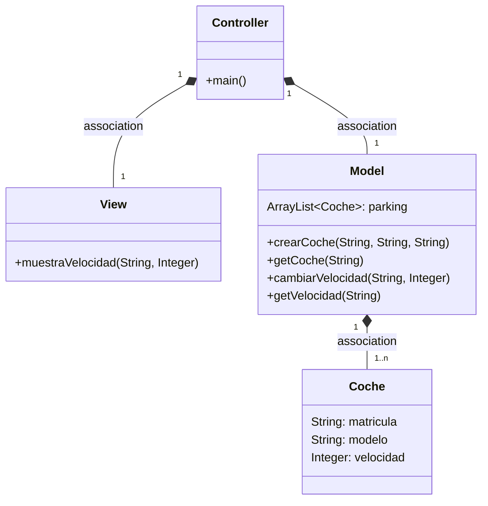
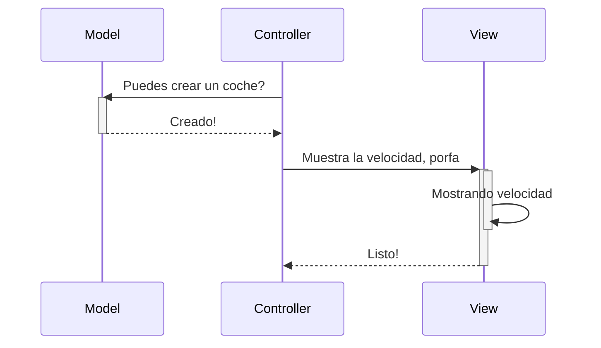
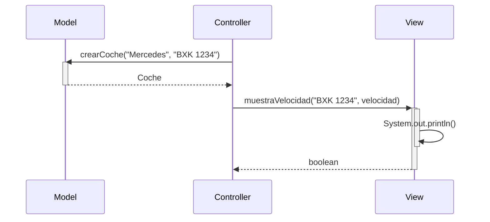

# EXAMEN OBSERVER DEL 04/06/2025
### Sistema de Alerta de Combustible Bajo
1. **ObserverDeposito**: Clase observadora que verifica el nivel de combustible
    - Se activa cuando el depósito baja de 10 litros
    - Muestra un mensaje de alerta mediante la View
2. **Puntos de Activación**:
    - Cuando el coche avanza (consumo de gasolina) `avanzarM()`
    - Cuando se reposta gasolina  `ponerGasolinaM()`

## Cómo Probar la Funcionalidad

1. Crear un coche con poco combustible:
   Al crear un coche y repuesta menos de 10 litros para que salte la alerta.
2. Avanzar el coche:
   Tambien al crear un coche y ponerle 11 litros y darle una velocidad de 10
   al avanzar 20 perdera dos litros y se activará la alerta.

## Diagrma de secuencia del observer

````mermaid
sequenceDiagram
    participant View
    participant Controller
    participant ObserverDeposito
    participant Model
    %% Proceso de repostar
    Controller->>+Model: ponerGasolinaC()
    Model->>+ObserverDeposito: update()
    deactivate ObserverDeposito
    deactivate Model
    ObserverDeposito->>View: alertaRepostar()
   

%% Proceso de avanzar
    Controller->>+Model: avanzarC()
    Model->>+ObserverDeposito: update()
    deactivate Model
    deactivate ObserverDeposito
    ObserverDeposito->>View: alertaRepostar()
``````
## CAPTURAS DE VERIFICACIÓN
Primera captura donde se muestra que el coche al azanzar pierde gasolina y al bajar de 10litros salta la alerta el aviso.

---
Segunda captura donde se muestra que al repostar una cantidad inferior a 10 litros tambien salta el aviso.

----------------------------
FIN DEL EXAMEN OBSERVER
--------------------------


# EXAMEN DEL 28-05-2025

Al implementar la función del modelo `avanzar()`, me di cuenta de que en el pseudocódigo no incluí ninguna forma de saber qué coche quieres hacer avanzar.  
También, en el pseudocódigo solo compruebo que la cantidad que quiero avanzar sea positiva, pero en el código tambien compruebo que el coche exista .  
Por último, leyendo ahora el ejercicio, veo que el consumo depende de la velocidad y de la distancia, y en papel solo tuve en cuenta la distancia.
La forma acual es : depósito - (coche.velocidad \* metros) / 100 para calcular el consumo de gasolina y a mayor velocidad mas consumo tienes.
Cuando la anterior era solo `deposito - metros`, que no tenía en cuenta la velocidad.
Ahora, viéndolo ya implementado, cambiaría para que no fuera `void` y devolviera un booleano para saber si se ha podido avanzar o no.

En cambio, la función de `ponerGasolina()` sí que la he implementado como en el pseudocódigo, ya que no hay que comprobar nada más que la cantidad de gasolina sea positiva.
A parte de la View claro, que ya no recordama como estaba.

FIN DEL EXAMEN
----------

# Arquitectura MVC

Aplicación que trabaja con objetos coches, modifica la velocidad y la muestra

---
## Diagrama de clases:



---

## Diagrama de Secuencia

Ejemplo básico del procedimiento, sin utilizar los nombres de los métodos




El mismo diagrama con los nombres de los métodos



