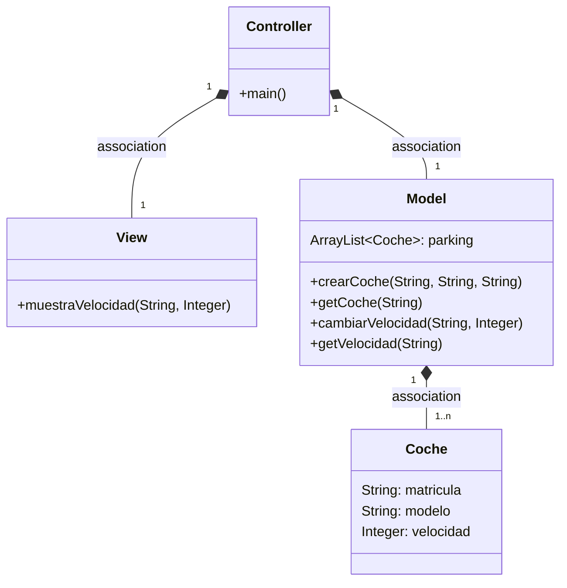
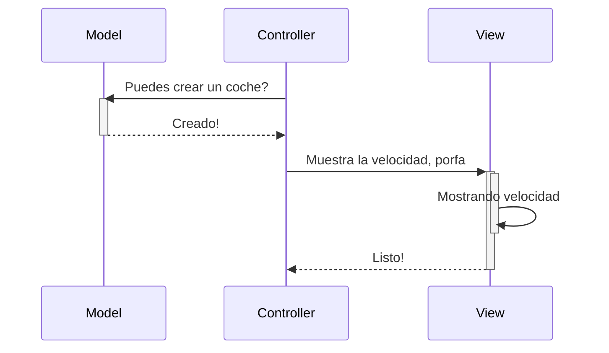
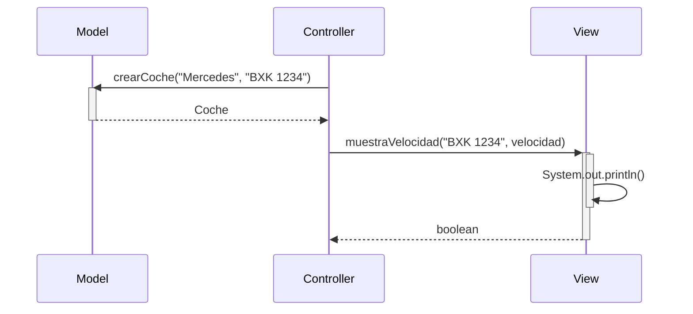

# EXAMEN
Al implementar la funcion del model de avanzar() me di cuenta de que en el pseudo codigo no meti ninguna forma para saber de que coche quieres hacer avanzar.
Tambien en el pseudo codigo solo compruebo que la cantidad que quiero avanzar sea positiva pero en el codigo compuebo que el coche exista.
Y por ultimo leyendo ahora el ejerccio veo que el consumo depende de la velocidad y de la distancia, y en papel solo tuve en cuenta la distancia.
deposito - (coche.velocidad * metros) / 100 para calcular el consumo de gasolina. 
Ahora viendolo ya implementado cambiaria para que no fuera void y devolviera un booleano para saber si se ha podido avanzar o no.

En cambio la funcion de ponerGasolina() si que la he implementado como en el pseudo codigo, ya que no hay que comprobar nada mas que la cantidad de gasolina sea positiva.

FIN DEL EXAMEN
----------

# Arquitectura MVC

Aplicación que trabaja con objetos coches, modifica la velocidad y la muestra

---
## Diagrama de clases:

---

## Diagrama de Secuencia

Ejemplo básico del procedimiento, sin utilizar los nombres de los métodos

El mismo diagrama con los nombres de los métodos

